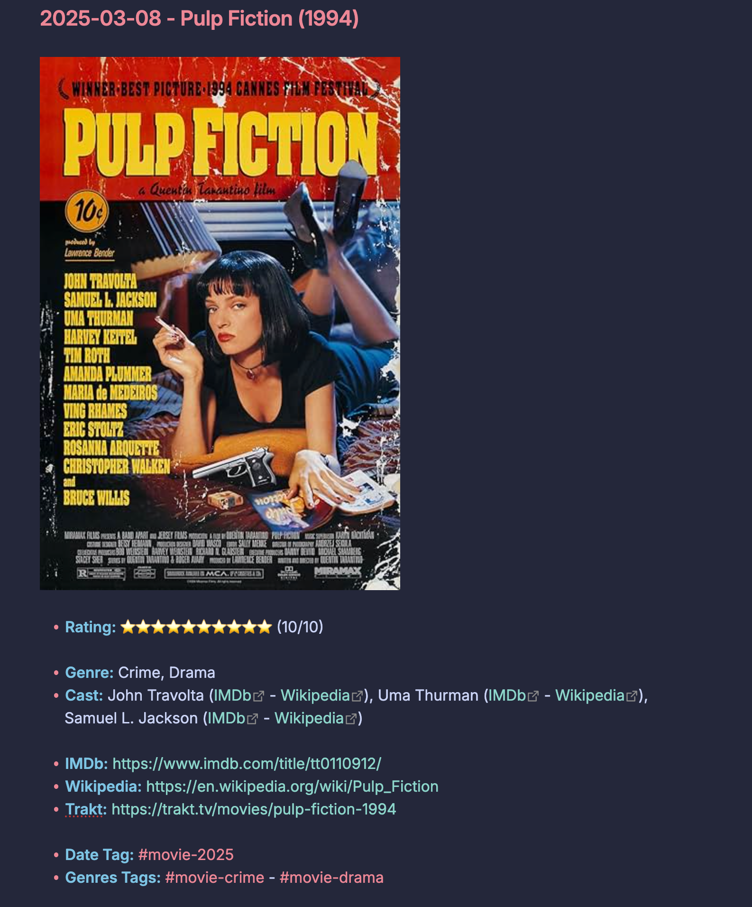
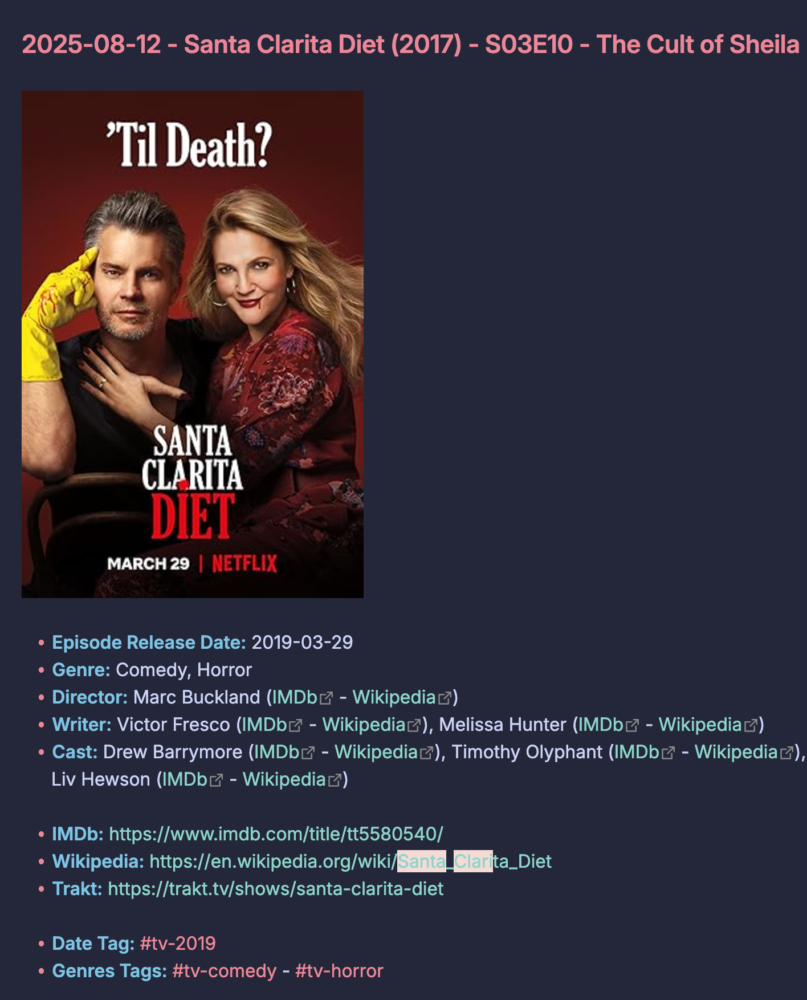

# Trakt Export To Markdown

Trakt made its UI awful, so I fixed it by only using them for Scrobble and making my own UI from their data export.

This project convert your [Trakt](https://trakt.tv/) export into beautiful, chronological markdown notes (made mainly to work in Obsidian), with local poster images, genres, actors, directors, writers, and direct links for IMDb, Wikipedia, and Trakt.

---

## Screenshots

(Made in Obsidian with the Catppuccin-Machiato color scheme)

### Movie



### TV Episode



---

## Usage

1. **Export your Trakt data** from [your settings page](https://app.trakt.tv/settings/data).
2. **Extract your Trakt data to a folder named bellow "trakt-export"**
2. **Obtain a free OMDB API key:** [Get it here.](https://www.omdbapi.com/apikey.aspx)
3. **Install the dependency:**
   ```sh
   pip install requests
   ```
4. **Run the script:**
   ```sh
   export OMDB_API_KEY=your_api_key_here
   python trakt_to_markdown.py /path/to/your/trakt-export/
   ```
   - Output appears in `trakt-markdown/` with a `00-Posters/` folder for images.
   - `.md` files are ready!

Note: When moving the output to the markdown software you're using, it is strongly encouraged that you also move the (hidden) `.omdb_cache.json` cache file along with them. It will save you a massive amount of time the next time you run the script with it next to it (to get updated markdown files).

---

## Scripts difference

- `trakt_to_markdown.py`: The normal script
- `trakt_to_markdown_fullsize.py`: A modification of the normal script to download the poster in the best quality possible, this seemed to be a good idea at first, but after trying it, I discovered that my "collection" of around 500 posters was more than 700MB compared to the 18MB of the normal script

---

## Example Output

### Movie

```markdown
### 2026-02-12 - PG: Psycho Goreman (2020)


- **Rating:** ⭐⭐⭐⭐⭐⭐⭐⭐⭐⭐ (10/10)

- **Genre:** Comedy, Horror, Sci-Fi
- **Director:** Steven Kostanski ([IMDb](https://www.imdb.com/find/?q=Steven+Kostanski&s=nm) - [Wikipedia](https://en.wikipedia.org/wiki/Steven_Kostanski))
- **Writer:** Steven Kostanski ([IMDb](https://www.imdb.com/find/?q=Steven+Kostanski&s=nm) - [Wikipedia](https://en.wikipedia.org/wiki/Steven_Kostanski))
- **Cast:** Nita-Josée Hanna ([IMDb](https://www.imdb.com/find/?q=Nita-Jos%C3%A9e+Hanna&s=nm) - [Wikipedia](https://en.wikipedia.org/wiki/Nita-Jos%C3%A9e_Hanna)), Owen Myre ([IMDb](https://www.imdb.com/find/?q=Owen+Myre&s=nm) - [Wikipedia](https://en.wikipedia.org/wiki/Owen_Myre)), Matthew Ninaber ([IMDb](https://www.imdb.com/find/?q=Matthew+Ninaber&s=nm) - [Wikipedia](https://en.wikipedia.org/wiki/Matthew_Ninaber))

- **IMDb:** https://www.imdb.com/title/tt11252440/
- **Wikipedia:** https://en.wikipedia.org/wiki/PG%3A_Psycho_Goreman
- **Trakt:** https://trakt.tv/movies/pg-psycho-goreman-2020

- **Date Tag:** #movie-2020
- **Genres Tags:** #movie-comedy - #movie-horror - #movie-sci-fi
```

### TV Episode

```markdown
### 2025-08-12 - Santa Clarita Diet (2017) - S03E10 - The Cult of Sheila


- **Episode Release Date:** 2019-03-29
- **Genre:** Comedy, Horror
- **Director:** Marc Buckland ([IMDb](https://www.imdb.com/find/?q=Marc+Buckland&s=nm) - [Wikipedia](https://en.wikipedia.org/wiki/Marc_Buckland))
- **Writer:** Victor Fresco ([IMDb](https://www.imdb.com/find/?q=Victor+Fresco&s=nm) - [Wikipedia](https://en.wikipedia.org/wiki/Victor_Fresco)), Melissa Hunter ([IMDb](https://www.imdb.com/find/?q=Melissa+Hunter&s=nm) - [Wikipedia](https://en.wikipedia.org/wiki/Melissa_Hunter))
- **Cast:** Drew Barrymore ([IMDb](https://www.imdb.com/find/?q=Drew+Barrymore&s=nm) - [Wikipedia](https://en.wikipedia.org/wiki/Drew_Barrymore)), Timothy Olyphant ([IMDb](https://www.imdb.com/find/?q=Timothy+Olyphant&s=nm) - [Wikipedia](https://en.wikipedia.org/wiki/Timothy_Olyphant)), Liv Hewson ([IMDb](https://www.imdb.com/find/?q=Liv+Hewson&s=nm) - [Wikipedia](https://en.wikipedia.org/wiki/Liv_Hewson))

- **IMDb:** https://www.imdb.com/title/tt5580540/
- **Wikipedia:** https://en.wikipedia.org/wiki/Santa_Clarita_Diet
- **Trakt:** https://trakt.tv/shows/santa-clarita-diet

- **Date Tag:** #tv-2019
- **Genres Tags:** #tv-comedy - #tv-horror
```

---

## About the number of API requests

I have decided to make the script get the episode original release date because this is often useful. This requires 1 OMDb API request for each episode. You might have to do it over multiple days or pay for a key with higher limit than 1000 if you've been using Trakt for a while. I personally had around 3500 episodes. If you don't want this feature, you can just edit the script and remove the whole logic to get and print it.

---

## AI Acknowledgement

This was made with the help of LLM, a lot of it was still "human" made.

The project was written and refined with two different LLM "AI" models: Claude Opus 4.6 and GPT-4.1 running in "GitHub Copilot Chat".

I can't personally write Python from scratch, but I made those LLM do exactly what I wanted, and then I tweaked a lot of it by hand. There was a LOT of back and forth, and a lot of "human" work, but this is, at its core still a project made using LLMs.

It took me more than 10+ hours of work (minimum).

This was for personal use first and foremost, I just decided to release it.

Consider this provided as is, as the LICENSE says.

AI sucks, but I'm not a developer, have no interest in becoming one, and I'm too poor to hire a contractor. Blame capitalism, not me.
